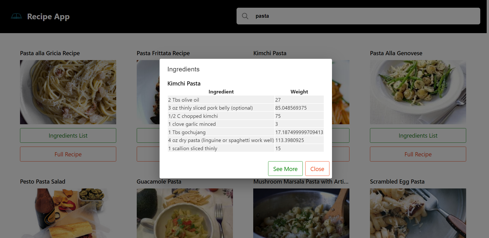

# Recipe App 
Recipe app finds the recipes on the basis of searched ingredient. We will have App designing, state management, API integration


#### Features integrated:
- API setup with Edmam.com
- API Integration (axios) `npm install axios`
- Dialog using Material UI 
```bash
npm install @mui/material @emotion/react @emotion/styled --legacy-peer-deps 

npm install @mui/icons-material --legacy-peer-deps 
```
- Responsive UI with Flex 
- Mobile Responsive Design 

#### How the App will work? 
1. When user enters the ingredient for the recipe in the searchbar, the recipe will show up, each recipe will be in a card format 
2. card contains 
- ingredients (when user clicks on this a small popup on screen)
- complete recipe (redirects to a new website)

#### Setting up API keys from Edmam (Database for All recipes)
They provide API's to fetch recipe's 
- register with `Recipe search API`
```bash
APP_ID
APP_KEY
```
### Whats happening in the code? 
> App.js 
```bash
import React from "react";
import './index.css'
import AppComponent from "./components/AppComponent";

const App = () => {
  return (
    <>
    <AppComponent/>
    </>
  )
}

export default App
```
> AppComponent.js 
- Whenever the user enters something in the input field an `onTextChange` event handler is invoked, inside which were updating our `searchQuery` which technically stores the input that the user enters, were also keeping track of the time through a `timeoutId` state (as in, when the user enters something how much time should our application wait before populating the DOM with the fetched results from the API endpoint, we acheive the time wait period with the `setTimeout` which waits for around 500ms, if the user hasnt typed anything in that time frame, it will render the results on the page )
- When the `timeoutId` reaches 500ms, a call is made to fetch the data from the `fetchData()` which is technically responsible for making a request to the API endpoint (where we integrate our APP_ID and APP_KEY as well as a dyanamic search query) and retreiving the response in the form of JSON object, and we update the `RecipeList` state with all the content present inside `response.data.hits` object.
- Now through map method we added a functionality to loop over every element present inside `recipeList` (for example, if user enters pizza recipeList state will contain all the recipe's present for pizza) and it passes each recipe object to `RecipeComponent` in the form of props 
```bash
import React, { useState } from "react";
import Axios from "axios";
import img1 from '../images/hamburger.svg'
import img2 from '../images/search-icon.svg'
import RecipeComponent from "./RecipeComponent";
import styled from 'styled-components'
import '../index.css'

const APP_ID = "90de009a";
const APP_KEY = "b1dbb8e46a7813c3da3c985d75e5be86";

const RecipeListContainer = styled.div`
  display: flex;
  flex-direction: row;
  flex-wrap: wrap;
  padding: 30px;
  gap: 20px;
  justify-content: space-evenly;
`;

const Placeholder = styled.img`
  width: 120px;
  height: 120px;
  margin: 200px;
  opacity: 50%;
`;

const AppComponent = () => {
  const [searchQuery, updateSearchQuery] = useState("");

  #this state stores the recipe list for a particular search 
  const [recipeList, updateRecipeList] = useState([]);

  #this state is for managing the time required displaying the search results after user enters in the search bar,
  const [timeoutId, updateTimeoutId] = useState();

  #fetching JSON data from the API 
  #reccieve the searchstring (whatever user types in the search bar)
  #based on what the user enters in the searchstring, axios tries to find it from the data available to it, after data is recieved, DOM is populated with this data in the form of cards, each card representing a recipe for that particular value present inside the JSON data of the URL endpoint 
  const fetchData = async (searchString) => {
    const response = await Axios.get(
      `https:api.edamam.com/search?q=${searchString}&app_id=${APP_ID}&app_key=${APP_KEY}`,
    );
    console.log('response',response)
    updateRecipeList(response.data.hits);
  };

  #for every text change were making an API call 
  #use concept of debouncing for making API calls 
  #when user completes typing in the search bar and make the app wait for around 1/2second (500ms) before loading the results 
  const onTextChange = (e) => {
    #every time user searchs in searchbar again, the previous timeout is erased, so we start with a fresh slate 
    clearTimeout(timeoutId);

    updateSearchQuery(e.target.value);
    #were storing the timeout in a constant because we'll be updating the time state with this value 
    const timeout = setTimeout(() => fetchData(e.target.value), 500);
    #updating the time state 
    updateTimeoutId(timeout);
  };

  return (
    <div className='Container'>
      <div className='Header'>
        <div className='AppName'>
          
          Recipe Finder
        </div>
        <div className='SearchBox'>
          
          <input className='SearchInput'
            placeholder="Search Recipe"
            value={searchQuery}
            onChange={onTextChange}
          />
        </div>
        # Searchbox ends  
      </div>
      # header ends  

      #whenver there is some content inside recipeList, map over the recipeList and return the recipeComponent else if there is no content inside recipeList then display the default svg
      <RecipeListContainer>
        {recipeList?.length ? (
          recipeList.map((recipe, index) => (
            <RecipeComponent key={index} recipe={recipe.recipe} />
          ))
        ) : (
          <Placeholder src={img1} />
        )}
      </RecipeListContainer>
     # recipelistcontainer ends 
    </div>
    #container ends 
  );
};

export default AppComponent;
```
> RecipeComponent.js 
- Props passed from `AppComponent` is recieved over here, and we use array destructuring to retreive every sub object (label, image, ingredients, url) present inside the `recipe` object, since we need this to render `ingredientslist` inside the popup box 
- I've imported some Dialogs from MUI for popup integration. 
- Each card that is rendered (specifying each recipe present inside the recipeList object) contains an image, label, ingredients button and see complete recipe button. When user clicks on `see complete recipe` they are redirected to the `url` the recipe was fetched from (url, image, label is recipe object's sub object). However when user clicks on `ingredient's button` then a popup is opened which contains `see more` and `close` button at the bottom, label on the top, and the ingredients rendered in the body section in a tabular format.
```bash
import React, { useState } from "react";
import Dialog from '@mui/material/Dialog'
import DialogContent from '@mui/material/DialogContent'
import DialogTitle from '@mui/material/DialogTitle'
import DialogActions from '@mui/material/DialogActions'
import '../index.css'

const RecipeComponent = (props) => {
  #if Dialog is open or not, show or dont show the dialog
  const [show, setShow] = useState("");

  #recieve props from recipe object which returns every recipe present for a partular search, defined inside RecipeListContainer inside App component 
  #const {recipe} = props

  console.log('props', props)
  #destructuring recipe object 
  const { label, image, ingredients, url } = props.recipe;

  return (
    <div className='RecipeContainer'>
      <Dialog
        onClose={() => console.log("adsadad")}
        aria-labelledby="simple-dialog-title"
        open={!!show}>

        <DialogTitle>Ingredients</DialogTitle>
        <DialogContent>
          <div className='RecipeName'>{label}</div>
          <table>
            <thead>
              <th>Food</th>
              <th>Text</th>
            </thead>
            <tbody>
              {ingredients.map((ingredient, index) => (
                <tr key={index} className="ingredient-list">
                  <td>{ingredient.food}</td>
                  <td>{ingredient.text}</td>
                </tr>
              ))}
            </tbody>
          </table>
        </DialogContent>
        <DialogActions>
          <div className='SeeNewTab' onClick={() => window.open(url)}>See More</div>
          <div className='SeeMoreText' onClick={() => setShow("")}>Close</div>
        </DialogActions>
      </Dialog>

      
      <div className='RecipeName'>{label}</div>

      # when user clicks on ingredients button, setShow will be set to true, then open the popup 
      <div className='IngredientsText' onClick={() => setShow(!show)}>
        Ingredients
      </div>
      
      # when user clicks on see complete recipe it redirects to the url passed from recipe object 
      <div className='SeeMoreText' onClick={() => window.open(url)}>
        See Complete Recipe
      </div>

    </div>
   # recipe container ends 
  );
};

export default RecipeComponent
```

